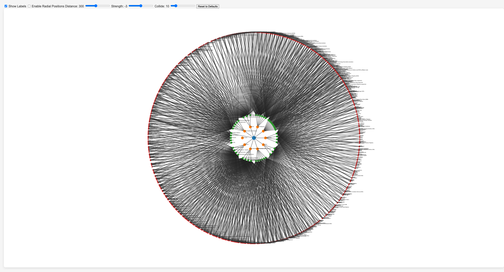

# CNCF Tools Visualization

A D3.js-based visualization to represent CNCF tools based on their categories and subcategories.

## Features

- Interactive SVG visualization.
- Categorization of tools based on `Category` and `Subcategory`.
- Draggable nodes with interactive tooltips.
- Configurable visualization parameters using sliders:
  - Link Distance
  - Charge Strength
  - Collision Strength
- Option to toggle labels.
- Option to enable/disable radial positioning.
- Smooth transition effects.

## Getting Started

### Prerequisites

- A modern web browser (Chrome, Firefox, Safari, etc.).
- The `d3.js` library (provided in the repository).

### Setup

1. Clone the repository to your local machine.
2. Navigate to the project directory.
3. Open `index.html` in your web browser to view the visualization.

## Usage

- Use the `Show Labels` checkbox to toggle labels on/off.
- Use the `Enable Radial Positions` checkbox to toggle the radial positioning of nodes.
- Adjust the sliders to configure the visualization parameters:
  - `Distance`: Adjusts the distance between linked nodes.
  - `Strength`: Adjusts the repelling force strength between nodes.
  - `Collide`: Adjusts the collision strength between nodes.

## Customization

The data for the visualization is loaded from `restructured_data.json`. You can modify or expand this data to customize the visualization.

## Credits

This visualization was created using [D3.js](https://d3js.org/), a powerful JavaScript library for producing dynamic, interactive data visualizations in web browsers.

## License

This project is open-source. Feel free to use, modify, and distribute as you see fit. Please provide appropriate attribution if using in a public project.
